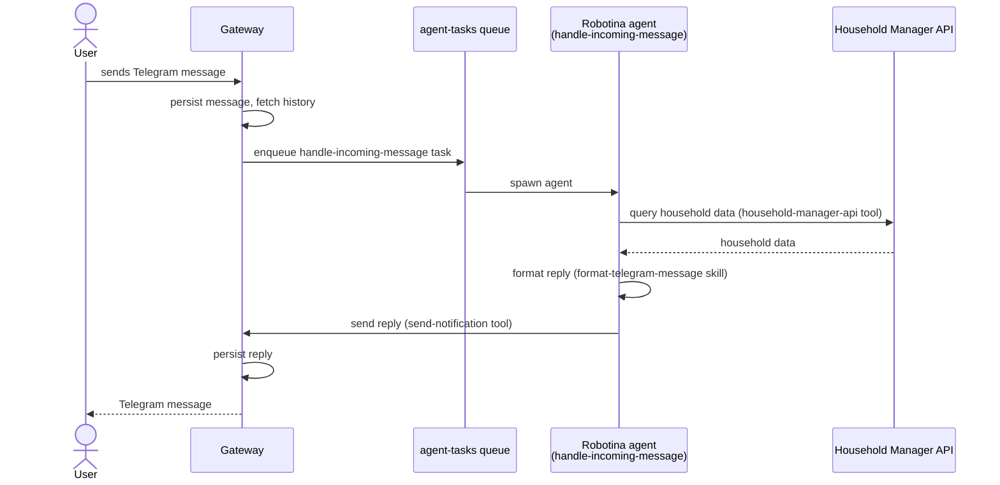
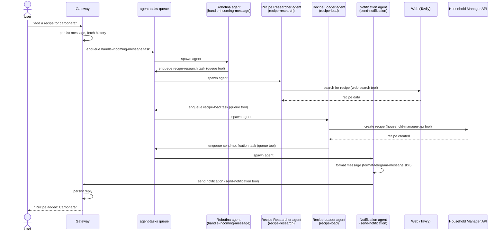

# Robotina
## Project Overview:
Robotina is a home assistant helping families organize their recipes, meal plan, groceries stock and other useful tasks for households.

Robotina is a component of a slightly bigger system that comprises 3 components:
- A user application (client)
- A backend service
- Robotina
> This repository deals specifically with "Robotina" component

The source of truth of household data in the system is the "backend" component.
Users can use the application to consult and edit their household information manually (recipes, meal plan, etc...)
Users can also talk to Robotina so that robotina does this on their behalf.
Robotina has access to read and modify household information on their behalf.
In the future Robotina could serve multiple households, but during research and development phase Robotina will serve only one household. We are adding the field household_id to some of our models and abstractions to make it future proof.
Until multi-household support is developer household_id will be static and gotten from and environment variable.

Robotina inner workings is described by four areas:
- triggers: telegram + scheduled tasks
- context: what's injected into the model every time
- abilities: tools and skills the agent can use (often produce side effects)
- output: results of each task performed

In it's core Robotina works as a tasks queue. When a complex task arrives, Robotina will split it into multiple simple tasks, each of which is small enough that can be solved by a specialized agent in a single run.

### Triggers
To ensure that the agent process is executed with concurrency exactly equal to one, the agent is triggered by exactly one task queue (agent-task-queue), which acts as a multiplexer for work comming from different sources.
The possible sources of agent tasks are:
- User messages: user can write to the agent asking questions or delegating tasks. Multiple chat clients may be used. All incomming communications will be centralized by the "gateway" component described on the Tech Spec. User messages are not processed immediately, instead they enqueued for the agent to process when available.
- Scheduled tasks: The agent or application maintainers can create scheduled tasks. The agent doesn't process this tasks directly; instead the tasks are enqueued in the agent-task-queue for the agent to process when available.
- Agent created tasks: The agent itself may push a task to the agent-task-queue to perform a task as soon as possible.

### Context
The context the agent gets injected at each turn is dynamic and depends on the task type.
For example: An "incomming-user-message" task type may receive the user chat history, while a "research-recipe" task type may receive information about the recipe.

### Abilities
The agent has two ways to interact with its environment: Skills and Tools.

Skills: These are markdown files that instruct the agent how to achieve tasks. They are broken down into small chunks the agent can load as needed to avoid context bloat. Different skills will be required for different tasks. For closed end tasks the agent will get a hint at what skills will be needed to perform the task.

Tools: Regular agent tools allowing the agent to perform actions by calling code. They will be used to interact with the queue, the scheduler and external apis. Different tools will be required by different task types and should be loaded dynamically based on the task type.

### Output
All agent runs produce an output which should be persisted along with the completed task status (success or failure) on the agent-task-queue.
Only some agent runs may produce an output message to the user.
Some runs will only side effects by writting data to the backend, creating a schedule tasks or queueing a subsequent task.

## Scope:
This document describes the features to be implemented for **Phase 1** of Robotina.
It needs to covers two user stories:
- as a user I want to ask robotina questions in natural language about my household and get intelligent responses back based on the information stored on household-manager backend.
- as a user I want to ask robotina to research a recipe and eventually see that the recipe was added to my household recipes

**Workflow 1: user asks a question about their household**



**Workflow 2: user asks to research and add a recipe**


To achieve this workflows we'll create:

1. Three Agents:
    - Robotina: Handles receiving and answering telegram messages. Has read access to the household-manager api to read and answer user questions.
    - Recipe Researcher: Handles researching recipes online
    - Recipe Loader: handles loading a recipe into household-manager backend.
2. Four task types:
    - handle-incomming-message
    - recipe-research
    - recipe-load
    - send-notification
3. Three task specific skills:
    - recipe-research
    - recipe-load
    - format-telegram-message

## Tech Spec:
Comprised of the following components:
- gateway
- scheduler
- queue
- agent
- LLM

### Diagrams:
- [Layers Diagram](./layers.png)
- [Components Diagram](./components.png)

### Gateway
The gateway centralises messages incoming from different messaging platforms, abstracting away from the agent the details of communication handling. On the first iteration, only Telegram will be integrated via a Telegram bot.
When a message arrives, the gateway does not trigger the agent directly. Instead it:
1. Persists the incoming message to Postgres
2. Fetches the last X messages from the conversation history (X is configurable via env var)
3. Enqueues a `handle-incoming-message` task (see Queue section for the input type)

When the agent produces a reply, the gateway sends it to the user via Telegram and persists the outgoing message to Postgres.

#### Storage
Conversation history is stored in Postgres. Alembic is used for migrations. Prisma is used for data models.

```prisma
enum Platform {
  TELEGRAM
}

enum MessageRole {
  USER
  ASSISTANT
}

model Conversation {
  id           String    @id @default(uuid())
  platform     Platform
  chatId       String
  householdId  String
  createdAt    DateTime  @default(now())
  updatedAt    DateTime  @updatedAt
  messages     Message[]

  @@unique([platform, chatId])
}

model Message {
  id                 String       @id @default(uuid())
  conversation       Conversation @relation(fields: [conversationId], references: [id])
  conversationId     String
  platformMessageId  String       @unique   // platform-assigned ID, used for deduplication
  role               MessageRole
  text               String
  sentAt             DateTime               // when the platform sent/received the message
  createdAt          DateTime     @default(now())
}
```

A `Conversation` groups all messages for a given `(platform, chatId)` pair. The `@@unique` constraint ensures only one conversation record exists per chat. `platformMessageId` is unique across all messages to prevent processing duplicates on retry.

### Scheduler
The scheduler is implemented using native RQ scheduling (RQ 2.5+), which supports both one-off future execution (`enqueue_at`) and cron-style recurring jobs — no external daemon or add-on package required. The RQ worker must be started with the `--with-scheduler` flag to activate the built-in scheduler.

A dedicated `scheduled-tasks` queue is used for deferred jobs, separate from `agent-tasks`. A lightweight worker consumes `scheduled-tasks` and its only responsibility is to move each job into `agent-tasks` for the agent to process. This keeps scheduling concerns decoupled from agent execution.

Tasks can be added to the scheduler in two ways:
- The agent can schedule tasks using the `scheduler` tool
- Other clients may add scheduled tasks via a scheduler API

Scheduled tasks carry a scheduling directive alongside the base task input:
```python
class ScheduledTask(BaseModel):
    task_type: str
    input: dict                   # serialized base task input (e.g. RecipeResearchInput)
    run_at: datetime | None       # one-off: execute at this datetime
    cron: str | None              # recurring: standard cron expression, e.g. "0 9 * * 1"
```

When a scheduled job fires it is dequeued from `scheduled-tasks` and re-enqueued into `agent-tasks` using the base input type, stripping the scheduling metadata.

#### Scheduler API

A simple HTTP API for managing scheduled tasks. All endpoints require an `Authorization: Bearer <token>` header (token read from env var).

**Create a scheduled task**
```
POST /api/scheduled-tasks
```
Request body:
| Field | Type | Required | Description |
|-------|------|----------|-------------|
| task_type | string | Yes | e.g. `recipe-research` |
| input | object | Yes | Task input matching the task type's input model |
| run_at | ISO 8601 datetime | No* | One-off: execute at this datetime |
| cron | string | No* | Recurring: cron expression, e.g. `"0 9 * * 1"` |

*Exactly one of `run_at` or `cron` must be provided.

Responses: `201` — created, returns the scheduled task object. `400` — validation error.

**List scheduled tasks**
```
GET /api/scheduled-tasks
```
Returns all scheduled tasks currently in the `scheduled-tasks` queue (pending jobs only — completed one-off jobs are not returned).

Response: `200` — array of scheduled task objects.

**Get a scheduled task**
```
GET /api/scheduled-tasks/:id
```
Responses: `200` — scheduled task object. `404` — not found.

**Delete a scheduled task**
```
DELETE /api/scheduled-tasks/:id
```
Cancels and removes the scheduled job from the queue. For recurring jobs this stops all future executions.

Responses: `204` — deleted. `404` — not found.

Scheduled task object shape (returned by all read endpoints):
```json
{
  "id": "rq-job-id",
  "task_type": "recipe-research",
  "input": { "query": "spaghetti carbonara", "household_id": "..." },
  "run_at": "2026-04-01T09:00:00Z",
  "cron": null,
  "created_at": "2026-03-24T10:00:00Z"
}
```

### Queue
The queue represents the work pending to be done by the agent. The agent reads from the queue and consumes tasks sequentially (concurrency exactly 1). Each task consumed from the queue is considered "an agent run".

The queue is implemented using Redis + RQ. Redis is configured with AOF persistence (appendfsync always) to guarantee that every enqueued task is flushed to disk before the operation is acknowledged. This ensures no tasks are silently lost across reboots or crashes.
Developers will use RQ Dashboard for job inspection.

The agent may enqueue a new task at the back of the queue (normal priority, default) or at the front (urgent, processed next). RQ supports this natively via the at_front parameter.
User icomming messages are always queued at the front of the queue (urgent, processed next).

Each task is an RQ job with the following properties:
- type — the task type (e.g. handle-incoming-message, recipe-research, ...)
- input — a strongly-typed JSONB payload passed as job arguments
- output — a strongly-typed result stored in the RQ result backend
- status — managed by RQ: queued | started | finished | failed
- started_at — managed by RQ, set the worker picks up the job
- household_id — Which household the task is for.
- completed_at — managed by RQ, set on finish or failure

Failed jobs are moved automatically by RQ to a failed job registry. This serves as the dead letter queue — failed jobs are retained with their exception info and can be inspected or re-queued by application maintainers. This is separate from the main task queue concern.          

The result_ttl and failure_ttl for all jobs should be set to infinit (-1)

#### Task Types

Shared models:
```python
class Message(BaseModel):
    message_id: str
    role: Literal["user", "assistant"]
    text: str
    sent_at: datetime

class ReplyContext(BaseModel):
    platform: Literal["telegram"]
    chat_id: str
    user_id: str

class RecipeIngredient(BaseModel):
    food_name: str            # human-readable name, e.g. "Huevo" — resolved to foodId by recipe-load
    unit_name: str | None     # human-readable unit, e.g. "kilogramo" — resolved to unitId by recipe-load
    quantity: float | None
    note: str | None

class RecipeStep(BaseModel):
    body: str                 # instruction text
    title: str | None         # optional step heading

class RecipeData(BaseModel):
    name: str
    description: str | None
    servings_qty: int | None
    servings_unit: str | None  # e.g. "porciones"
    prep_time: int | None      # minutes
    cook_time: int | None      # minutes
    total_time: int | None     # minutes
    source_url: str | None     # original recipe URL if found
    ingredients: list[RecipeIngredient]
    steps: list[RecipeStep]
```

> `RecipeData` uses human-readable food and unit names because the recipe-research agent has no access to household-manager IDs. The recipe-load agent is responsible for resolving names to `foodId` / `unitId` via `GET /api/foods?name=` and `GET /api/units?name=` before calling `POST /api/recipes`.

**handle-incoming-message**
```python
class IncomingMessageInput(BaseModel):
    message_id: str               # platform-assigned ID, used for deduplication
    platform: Literal["telegram"]
    received_at: datetime         # when the gateway received the message
    chat_id: str                  # platform chat/thread identifier
    user_id: str                  # platform user identifier
    household_id: str             # populated by the gateway from env var
    text: str                     # raw message text
    history: list[Message]        # last X messages, ordered oldest to newest

class IncomingMessageOutput(BaseModel):
    action: Literal["replied", "queued_tasks", "no_action"]
    queued_task_ids: list[str]
```

**recipe-research**
```python
class RecipeResearchInput(BaseModel):
    query: str                    # e.g. "spaghetti carbonara"
    household_id: str
    reply_context: ReplyContext   # forwarded through the chain for final notification

class RecipeResearchOutput(BaseModel):
    recipe: RecipeData            # structured recipe (name, ingredients, steps, etc.)
```

**recipe-load**
```python
class RecipeLoadInput(BaseModel):
    recipe: RecipeData
    household_id: str
    reply_context: ReplyContext

class RecipeLoadOutput(BaseModel):
    recipe_id: str
    recipe_name: str
```

**send-notification**
```python
class SendNotificationInput(BaseModel):
    platform: Literal["telegram"]
    chat_id: str
    user_id: str
    text: str

class SendNotificationOutput(BaseModel):
    message_id: str               # platform-assigned ID
```

### Agent

Every time a task is taken from the queue, an agent is spawned to process it. We call the process consuming the queue and spawning the agent "task-runner".

The task runner acts as a wrapper around the agent run and is responsible for updating the task status, result status, and output. When an agent run fails, the task is sent to RQ's failed job registry (the dead letter queue) for developer inspection.

Before spawning the agent, the task runner uses `agents.py` to determine, based on the task type:
- what LLM provider and model will be used
- what system prompt is injected
- what tools are given to the agent
- what skills are loaded into the agent

`agents.py` holds the authoritative agent configurations as Python objects, with direct references to tool and skill implementations:
```python
[
    {
        "type": "research-recipe",
        "model": { "baseUrl": "", "apiToken": "", "model": "" },
        "prompt": "./prompts/research-recipe/v002.md",
        "tools": [web_search, household_manager_api],
        "skills": [household_manager_skill, recipe_research_skill]
    }
]
```

The developer can provide a JSON override file by setting the `AGENTS_DEFINITION_FILEPATH` environment variable. This file specifies only the fields to override (e.g. model, prompt path) and is merged on top of the base configuration from `agents.py`. Prompt files are loaded from disk after the merge is applied, with paths resolved relative to the project root. This mechanism supports prompt experimentation, evaluation, and quick rollback if performance degradation is detected after release.

#### LLM Backend
The LLM backend configuration for any task must include full connection details (url, model, token). Two different agent runs may connect to different LLM instances, so provider-level configuration alone is insufficient.

#### Context & System Prompt
Since tasks are broken into their smallest possible form, each system prompt has one well-defined responsibility: solve its associated task type. Phase 1 requires four prompts:
- handle-incoming-message — understand a user's message in context of their conversation history, decide whether to answer directly or break the request into follow-up tasks.
- recipe-research — search for a recipe online using the available tools and produce a structured result.
- recipe-load — take a structured recipe and persist it to the household-manager backend.
- send-notification — compose and send a message to the user via the gateway.

These prompts are not yet written. They will be developed alongside the skills they depend on, since skills and prompts are tightly coupled — a prompt's instructions reference how a skill is structured, and a skill's content is written to complement the prompt it supports.                       
                                                                        
The precise wording of each prompt is intentionally left out of this spec. That is the role of the experimentation and prompt versioning infrastructure: prompts are written in markdown, versioned (old versions kept for history and regression), and can be swapped at runtime via AGENTS_DEFINITION_FILEPATH. This allows iterating on prompt quality independently of the rest of the system.  
                                                                        
Each skill configured for a task exposes an index_content property — a string containing the skill's main file, which includes a brief description and an index of sub-files. This index content is pre-loaded into the agent context at startup. The agent can load individual sub-files at runtime using the read-skill tool, avoiding unnecessary context bloat.                                       
                                                                        
Tools are loaded into the agent context based on what the specific task type requires.

#### Tools
Tools are written in a composable manner so that different sets can be loaded for different agent runs. When a tool call raises an error, the agent can recover by understanding the mistake and retrying with different parameters or a different tool.

The following tools are essential for phase 1:
- **household-manager-api**: calls the household-manager API, handling authentication and error codes on behalf of the agent. The tool reads the API key from an environment variable and injects it as an `Authorization: Bearer <token>` header on every request. The agent has no awareness of authentication. A `401` or `403` response is unrecoverable and must raise a hard error — these are not passed back to the agent. For phase 1, a single shared API key is used; per-household keys are out of scope.
- **read-skill**: loads a skill sub-file from `robotina/agent/skills/...`.
- **web-search**: searches the internet via the Tavily API.
- **scheduler**: allows the agent to CRUD scheduled jobs.
- **queue**: allows the agent to enqueue follow-up tasks (e.g. `recipe-research`, `recipe-load`).
- **send-notification**: sends a message to the user via the gateway (Telegram).

#### Skills
Skills are markdown files containing precise instructions for solving particular tasks. Each skill exposes an `index_content` property (its main file) which is pre-loaded into the agent context. Sub-files are loaded on demand via the `read-skill` tool.

Phase 1 skills:
- **recipe-research**: detailed instructions for searching multiple sites and summarizing recipe information.
- **recipe-load**: instructions for loading a researched recipe into the household-manager backend.
- **format-telegram-message**: instructions for structuring and formatting messages for Telegram.
- **household-manager**: instructions for interacting with the household-manager backend API to CRUD household data on behalf of the user. Authentication is handled by the `household-manager-api` tool, not by the agent. This skill is already implemented at `robotina/agent/skills/household-manager/*`.

### LLM
The LLM module is a Protocol-based abstraction over LangChain model backends. Consumers (agents, task-runner) depend only on the `LLMBackend` protocol — never on adapter internals — making it trivial to swap providers per task or for experimentation.

```python
from typing import Any, Protocol, runtime_checkable
from langchain_core.language_models import BaseChatModel
from langchain_core.tools import BaseTool

@runtime_checkable
class LLMBackend(Protocol):
    """Interface for LLM adapters. Each agent run holds its own backend instance."""

    @property
    def model(self) -> BaseChatModel:
        """The underlying LangChain chat model."""
        ...

    def create_agent(
        self,
        system_prompt: str,
        tools: list[BaseTool] | None = None,
    ) -> Any:
        """Return a runnable LangChain agent (e.g. create_react_agent) bound to this model."""
        ...
```

Each adapter reads its connection details (url, api key, model name) from the config passed in `agents.py` and wraps the appropriate LangChain model class (e.g. `ChatOllama`, `ChatAnthropic`, `ChatOpenAI`).

Phase 1 adapters:
- **ollama** — via `langchain-ollama`
- **anthropic** — via `langchain-anthropic`
- **openai** — via `langchain-openai`

## Non functional Requirements:
- System prompts should be written in markdown and versioned.
- All changes on the queue state are logged to console (new task queued, processing new task, task finished...)
- All actions performed by the agent are logged (llm start streaming, tool calls...)
- Debug log level can be enabled for each module independently (gateway, scheduler, queue, agent, LLM)
- Agents are implemented using Langchain.
- Agents should be carefully instrumented using LangWatch using OpenTelemetry. Traces are sent directly to LangWatch (no external collector). The LangWatch endpoint and API key are read from environment variables. The same instrumentation used in production must be active during experiment runs so that experiment traces appear correctly in LangWatch alongside their associated experiment collection.
- One LangWatch experiment per task type is required, excluding `handle-incoming-message`. Phase 1 experiments: `recipe-research`, `recipe-load`, `send-notification`.
- Each experiment is a standalone Python script runnable manually. Results are inspected via the LangWatch UI. A printed report is a nice-to-have.
- Experiment inputs are hardcoded in the script (e.g. a list of recipe name strings for `recipe-research`). Inputs should be few but representative enough to surface quality issues in the skill.
- Prompt version and model config are pinned per experiment run by attaching tags or metadata fields to the LangWatch experiment collection entry.
- Each experiment defines its own evaluation criteria. Evaluation criteria are TBD and will be designed as part of the planning phase for each individual skill — designing the experiment is a required deliverable when planning the development of a skill.
- The decision of which LangWatch instance (project, endpoint) an experiment writes to is left to the developer running it, controlled entirely via environment variables.

## Draft Project Structure:
```
robotina/
├── plans/
│   └── 01-kickoff/
├── src/
|   ├── llm/
|   ├── agent/
|   |   ├── agent.py
|   |   ├── agents.py
|   |   ├── prompts/
|   |   |    ├── robotina
|   |   |    |   ├── V001.md
|   |   |    |   └── V002.md
|   |   |    └── research-recipe
|   |   |        ├── V001.md
|   |   |        └── V002.md
|   |   ├── skills/
|   |   |   ├── recipe-load/
|   |   |   ├── format-telegram-message/
|   |   |   ├── research-recipe/
|   |   |   |   └── ...
|   |   |   └── household-manager/
|   |   |       └── ...
|   |   └── tools/
|   |       ├── send-notitication
|   |       ├── queue
|   |       ├── scheduler
|   |       ├── web-search (tavily)
|   |       └── household-manager
|   ├── queue/
|   ├── gateway/
|   └── scheduler/
├── experiments/
|   └── one experiment per task type/...
├── tests/
|   └── ...
├── README.md
└── pyproject.toml
```

## Development phases:

- Gateway infrastructure
- Agent Queue
- Agent Infrastructure (prompt loading, agents.py, instrumentation, experiments...)
- "Robotina" Task and Agent -- Handles telegram messages
- "Recipe Research" Task and Agent -- handles recipe research
- scheduler


