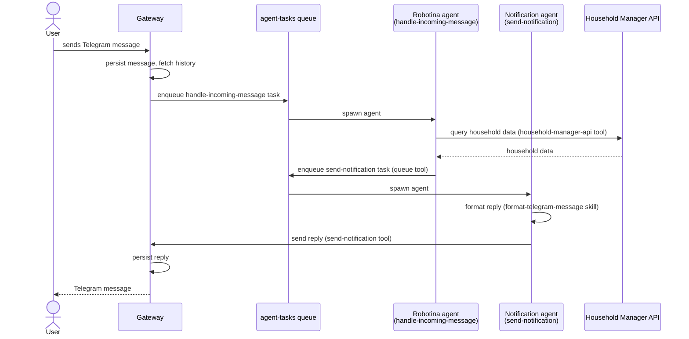
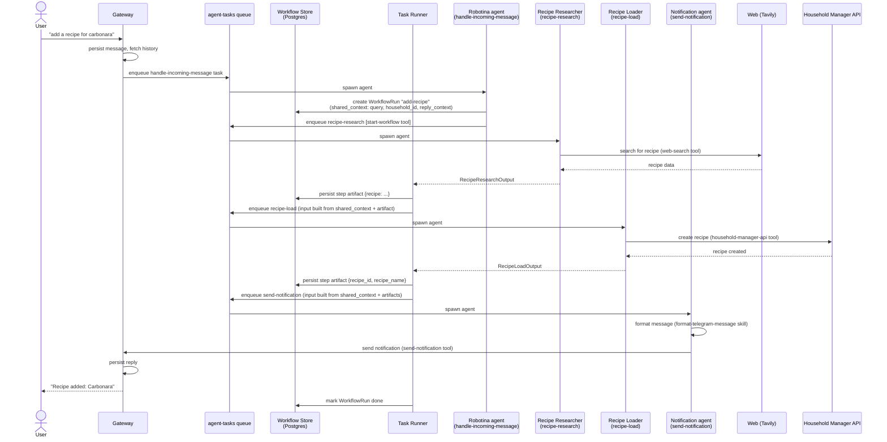

# Robotina

## Index
- [Project Overview](#project-overview)
  - [Triggers](#triggers)
  - [Context](#context)
  - [Abilities](#abilities)
  - [Output](#output)
- [Scope](#scope)
  - [Workflow 1: user asks a question about their household](#workflow-1-user-asks-a-question-about-their-household)
  - [Workflow 2: user asks to research and add a recipe](#workflow-2-user-asks-to-research-and-add-a-recipe)
- [Tech Spec](#tech-spec)
  - [Diagrams](#diagrams)
  - [Gateway](#gateway)
    - [Storage](#storage)

  - [Queue](#queue)
    - [Task Types](#task-types)
  - [Task Runner](#task-runner)
    - [Workflows](#workflows)
    - [Workflow Registry](#workflow-registry)
    - [Workflow Storage](#storage-1)
    - [Workflow Artifact Flow](#artifact-flow)
    - [Workflow Failure Handling](#failure-handling)
  - [Agent](#agent)
    - [LLM Backend](#llm-backend)
    - [Context & System Prompt](#context--system-prompt)
    - [Tools](#tools)
    - [Skills](#skills)
  - [LLM](#llm)
  - [Scheduler](#scheduler)
    - [Scheduler API](#scheduler-api)
  - [Non Functional Requirements](#non-functional-requirements)
  - [Draft Project Structure](#draft-project-structure)
  - [Developer Tooling Requirements](#developer-tooling-requirements)
- [Development Phases](#development-phases)

## Project Overview:
Robotina is a home assistant helping families organize their recipes, meal plan, groceries stock and other useful tasks for households.

Robotina is a component of a slightly bigger system that comprises 3 components:
- A user application (client)
- A backend service
- Robotina
> This repository deals specifically with "Robotina" component

The source of truth of household data in the system is the "backend" component.
Users can use the application to consult and edit their household information manually (recipes, meal plan, etc...)
Users can also talk to Robotina so that robotina does this on their behalf.
Robotina has access to read and modify household information on their behalf.
In the future Robotina could serve multiple households, but during research and development phase Robotina will serve only one household. We are adding the field household_id to some of our models and abstractions to make it future proof.
Until multi-household support is developed, household_id will be static and gotten from an environment variable.

Robotina inner workings is described by four areas:
- triggers: telegram + scheduled tasks
- context: what's injected into the model every time
- abilities: tools and skills the agent can use (often produce side effects)
- output: results of each task performed

In it's core Robotina works as a tasks queue. When a complex task arrives, Robotina will split it into multiple simple tasks, each of which is small enough that can be solved by a specialized agent in a single run.

### Triggers
To ensure that the agent process is executed with concurrency exactly equal to one, the agent is triggered by exactly one task queue (agent-task-queue), which acts as a multiplexer for work coming from different sources.
The possible sources of agent tasks are:
- User messages: user can write to the agent asking questions or delegating tasks. Multiple chat clients may be used. All incoming communications will be centralized by the "gateway" component described on the Tech Spec. User messages are not processed immediately, instead they enqueued for the agent to process when available.
- Scheduled tasks: The agent or application maintainers can create scheduled tasks. The agent doesn't process these tasks directly; instead the tasks are enqueued in the agent-task-queue for the agent to process when available.
- Agent created tasks: The agent itself may push a task to the agent-task-queue to perform a task as soon as possible.

### Workflows
Multi-step sequences are coordinated by a centralized orchestrator (task-runner) rather than by tasks enqueuing their own successors. This separates concerns: individual agents know nothing about the sequence they belong to — they just accept their input, do their job, and return their output. The task runner handles everything else.

### Agents
The context the agent gets injected at each turn is dynamic and depends on the task type.
For example: A `handle-incoming-message` task type may receive the user chat history, while a `recipe-research` task type may receive information about the recipe.

### Abilities
The agent has two ways to interact with its environment: Skills and Tools.

Skills: These are markdown files that instruct the agent how to achieve tasks. They are broken down into small chunks the agent can load as needed to avoid context bloat. Different skills will be required for different tasks. For closed end tasks the agent will get a hint at what skills will be needed to perform the task.

Tools: Regular agent tools allowing the agent to perform actions by calling code. They will be used to interact with the queue, the scheduler and external apis. Different tools will be required by different task types and should be loaded dynamically based on the task type.

### Output
All agent runs produce an output which should be persisted along with the completed task status (success or failure) on the agent-task-queue.
Only some agent runs may produce an output message to the user.
Some runs will only have side effects by writing data to the backend, creating scheduled tasks or queueing a subsequent task.

## Scope:
This document describes the features to be implemented for **Phase 1** of Robotina.
It must implement two user stories:
- as a user I want to ask robotina questions in natural language about my household and get intelligent responses back based on the information stored on household-manager backend.
- as a user I want to ask robotina to research a recipe and eventually see that the recipe was added to my household recipes

To achieve this workflows we'll create:

1. Four Agents:
    - Robotina: Handles receiving and answering telegram messages. Has read access to the household-manager api to read and answer user questions.
    - Recipe Researcher: Handles researching recipes online.
    - Recipe Loader: Handles loading a recipe into household-manager backend.
    - Notification: Receives pre-written text and ensures it is correctly formatted for Telegram rendering (links, bullet points, titles, etc.) before sending it via the Gateway.
2. Four task types:
    - handle-incoming-message
    - recipe-research
    - recipe-load
    - send-notification
3. Four skills:
    - recipe-research (new)
    - recipe-load (new)
    - format-telegram-message (new)
    - household-manager (already implemented, minor update to remove auth instructions)
4. Workflow infrastructure:
    - `WorkflowRun` / `WorkflowRunStep` Prisma models (Postgres)
    - `workflows.py` registry — defines multi-step workflow types alongside `agents.py`
    - `start-workflow` tool — used by agents to initiate a named workflow
**Workflow 1: user asks a question about their household**



**Workflow 2: user asks to research and add a recipe**


## Tech Spec:
Comprised of the following components:
- gateway
- scheduler
- queue
- agent
- LLM

### Diagrams:
- [Layers Diagram](./layers.png)
- [Components Diagram](./components.png)

### Gateway
The gateway centralises messages incoming from different messaging platforms, abstracting away from the agent the details of communication handling. On the first iteration, only Telegram will be integrated via a Telegram bot.
When a message arrives, the gateway does not trigger the agent directly. Instead it:
1. Persists the incoming message to Postgres
2. Fetches the last X messages from the conversation history (X is configurable via env var)
3. Enqueues a `handle-incoming-message` task (see Queue section for the input type)

When the agent produces a reply, the gateway sends it to the user via Telegram and persists the outgoing message to Postgres.

#### Storage
Conversation history is stored in Postgres. SQLAlchemy is used for data models. Alembic is used for migrations.

```python
import enum, uuid
from datetime import datetime
from sqlalchemy import String, DateTime, Enum, Text, ForeignKey, UniqueConstraint
from sqlalchemy.orm import DeclarativeBase, Mapped, mapped_column, relationship
from sqlalchemy.sql import func

class Platform(enum.Enum):
    TELEGRAM = "telegram"

class MessageRole(enum.Enum):
    USER = "user"
    ASSISTANT = "assistant"

class Conversation(Base):
    __tablename__ = "conversations"
    __table_args__ = (UniqueConstraint("platform", "chat_id"),)

    id: Mapped[str] = mapped_column(String, primary_key=True, default=lambda: str(uuid.uuid4()))
    platform: Mapped[Platform] = mapped_column(Enum(Platform), nullable=False)
    chat_id: Mapped[str] = mapped_column(String, nullable=False)
    household_id: Mapped[str] = mapped_column(String, nullable=False)
    created_at: Mapped[datetime] = mapped_column(DateTime, server_default=func.now())
    updated_at: Mapped[datetime] = mapped_column(DateTime, server_default=func.now(), onupdate=func.now())
    messages: Mapped[list["StoredMessage"]] = relationship(back_populates="conversation")

class StoredMessage(Base):
    __tablename__ = "stored_messages"

    id: Mapped[str] = mapped_column(String, primary_key=True, default=lambda: str(uuid.uuid4()))
    conversation_id: Mapped[str] = mapped_column(String, ForeignKey("conversations.id"), nullable=False)
    conversation: Mapped["Conversation"] = relationship(back_populates="messages")
    platform_message_id: Mapped[str] = mapped_column(String, unique=True, nullable=False)  # used for deduplication
    role: Mapped[MessageRole] = mapped_column(Enum(MessageRole), nullable=False)
    text: Mapped[str] = mapped_column(Text, nullable=False)
    sent_at: Mapped[datetime] = mapped_column(DateTime, nullable=False)  # when the platform sent/received the message
    created_at: Mapped[datetime] = mapped_column(DateTime, server_default=func.now())
```

A `Conversation` groups all messages for a given `(platform, chatId)` pair. The `@@unique` constraint ensures only one conversation record exists per chat. `StoredMessage.platformMessageId` is unique across all messages to prevent processing duplicates on retry.


### Queue
The queue represents the work pending to be done by the agent. The agent reads from the queue and consumes tasks sequentially (concurrency exactly 1). Each task consumed from the queue is considered "an agent run".

The queue is implemented using Redis + RQ. Redis is configured with AOF persistence (appendfsync always) to guarantee that every enqueued task is flushed to disk before the operation is acknowledged. This ensures no tasks are silently lost across reboots or crashes.
Developers will use RQ Dashboard for job inspection.

The agent may enqueue a new task at the back of the queue (normal priority, default) or at the front (urgent, processed next). RQ supports this natively via the at_front parameter.
User incoming messages are always queued at the front of the queue (urgent, processed next).

Each task is an RQ job with the following properties:
- type — the task type (e.g. handle-incoming-message, recipe-research, ...)
- input — a strongly-typed JSONB payload passed as job arguments
- output — a strongly-typed result stored in the RQ result backend
- status — managed by RQ: queued | started | finished | failed
- started_at — managed by RQ, set the worker picks up the job
- household_id — Which household the task is for.
- completed_at — managed by RQ, set on finish or failure

Failed jobs are moved automatically by RQ to a failed job registry. This serves as the dead letter queue — failed jobs are retained with their exception info and can be inspected or re-queued by application maintainers. This is separate from the main task queue concern.          

The result_ttl and failure_ttl for all jobs should be set to infinite (-1).
#### Task Types

Shared models:
```python
class Message(BaseModel):
    message_id: str
    role: Literal["user", "assistant"]
    text: str
    sent_at: datetime

class ReplyContext(BaseModel):
    platform: Literal["telegram"]
    chat_id: str
    user_id: str

class RecipeIngredient(BaseModel):
    food_name: str            # human-readable name, e.g. "Huevo" — resolved to foodId by recipe-load
    unit_name: str | None     # human-readable unit, e.g. "kilogramo" — resolved to unitId by recipe-load
    quantity: float | None
    note: str | None

class RecipeStep(BaseModel):
    body: str                 # instruction text
    title: str | None         # optional step heading

class RecipeData(BaseModel):
    name: str
    description: str | None
    servings_qty: int | None
    servings_unit: str | None  # e.g. "porciones"
    prep_time: int | None      # minutes
    cook_time: int | None      # minutes
    total_time: int | None     # minutes
    source_url: str | None     # original recipe URL if found
    ingredients: list[RecipeIngredient]
    steps: list[RecipeStep]
```

> `RecipeData` uses human-readable food and unit names because the recipe-research agent has no access to household-manager IDs. The recipe-load agent is responsible for resolving names to `foodId` / `unitId` via `GET /api/foods?name=` and `GET /api/units?name=` before calling `POST /api/recipes`.

> `ReplyContext` is **not** forwarded through intermediate task inputs. It is stored once in `WorkflowRun.sharedContext` when the workflow is created and is resolved by the task runner when building the `send-notification` input at the final step.

**handle-incoming-message**
```python
class IncomingMessageInput(BaseModel):
    message_id: str               # platform-assigned ID, used for deduplication
    platform: Literal["telegram"]
    received_at: datetime         # when the gateway received the message
    chat_id: str                  # platform chat/thread identifier
    user_id: str                  # platform user identifier
    household_id: str             # populated by the gateway from env var
    text: str                     # raw message text
    history: list[Message]        # last X messages, ordered oldest to newest

class IncomingMessageOutput(BaseModel):
    action: Literal["replied", "started_workflow", "no_action"]
    queued_task_ids: list[str]    # populated when action is "replied" (direct send-notification)
    workflow_run_id: str | None   # populated when action is "started_workflow"
```

**recipe-research**
```python
class RecipeResearchInput(BaseModel):
    query: str                    # e.g. "spaghetti carbonara"
    household_id: str
    # reply_context is NOT here — it lives in WorkflowRun.shared_context

class RecipeResearchOutput(BaseModel):
    recipe: RecipeData            # persisted to WorkflowRunStep.artifact by the task runner
```

**recipe-load**
```python
class RecipeLoadInput(BaseModel):
    recipe: RecipeData            # resolved from prior step's artifact by the task runner
    household_id: str
    # reply_context is NOT here — it lives in WorkflowRun.shared_context

class RecipeLoadOutput(BaseModel):
    recipe_id: str
    recipe_name: str              # persisted to WorkflowRunStep.artifact by the task runner
```

**send-notification**
```python
class SendNotificationInput(BaseModel):
    platform: Literal["telegram"]
    chat_id: str
    user_id: str
    text: str

class SendNotificationOutput(BaseModel):
    message_id: str               # platform-assigned ID
```

> The caller (whichever agent enqueues this task) is responsible for providing the full message text. The send-notification agent does not compose content — it only reformats the text for correct Telegram rendering and delivers it.

### Task Runner

The component that consumes the queue is called the **task runner**. It runs a single RQ worker with concurrency set to exactly one, processing jobs sequentially. This single-worker, synchronous constraint is intentional to limit agent concurrency to exactly one.

Task runner is capable of running multi-step sequences of tasks through it's "Workflow" Implementation, detailed below.
Before executing a job, the task runner will check if the job is associated with a workflow (through `WorkflowRunStep`). If it is, it will wrap the execution of the job, hooking it with workflow advancement.
For jobs that are associated with a If it is, workflow advancement is performed inline before the next queued job is picked up. The mechanics of this (artifact persistence, next-step enqueueing, failure propagation) are described in the [Workflows](#workflows) section below.

#### Workflows

The workflow engine has two moving parts: a **registry** that defines workflow structure, and a **store** (Postgres) that holds live run state. Advancement is handled handled by the task runner.

#### Workflow Registry

`workflows.py` (alongside `agents.py`) is the authoritative source for all workflow definitions. It maps a workflow type name to its ordered steps and the rules for building each step's input:

```python
class WorkflowStepDef(BaseModel):
    step_key: str                              # unique identifier within this workflow
    task_type: str                             # e.g. "recipe-research"
    build_input: Callable[[dict, dict], BaseModel]
    # ^ (shared_context, accumulated_artifacts) -> task input model

class WorkflowDefinition(BaseModel):
    workflow_type: str                         # e.g. "add-recipe"
    steps: list[WorkflowStepDef]
    on_failure: WorkflowStepDef | None         # optional cleanup/notification step on any failure

WORKFLOW_REGISTRY: dict[str, WorkflowDefinition] = {
    "add-recipe": WorkflowDefinition(
        workflow_type="add-recipe",
        steps=[
            WorkflowStepDef(
                step_key="research",
                task_type="recipe-research",
                build_input=lambda ctx, _: RecipeResearchInput(
                    query=ctx["recipe_query"],
                    household_id=ctx["household_id"],
                ),
            ),
            WorkflowStepDef(
                step_key="load",
                task_type="recipe-load",
                build_input=lambda ctx, artifacts: RecipeLoadInput(
                    recipe=artifacts["research"]["recipe"],
                    household_id=ctx["household_id"],
                ),
            ),
            WorkflowStepDef(
                step_key="notify",
                task_type="send-notification",
                build_input=lambda ctx, artifacts: SendNotificationInput(
                    **ctx["reply_context"],
                    text=f"Recipe added: {artifacts['load']['recipe_name']}",
                ),
            ),
        ],
        on_failure=WorkflowStepDef(
            step_key="notify-failure",
            task_type="send-notification",
            build_input=lambda ctx, artifacts: SendNotificationInput(
                **ctx["reply_context"],
                text="Sorry, I couldn't add the recipe.",
            ),
        ),
    )
}
```

The `build_input` callables receive `shared_context` (set at workflow creation, never mutated) and `accumulated_artifacts` (a dict of `{step_key: step_output}`, grown by the task runner as each step completes).

#### Workflow Storage

`WorkflowRun` and `WorkflowRunStep` are stored in the same Postgres database as the gateway's conversation tables. SQLAlchemy is used for models; Alembic handles migrations.

```python
import enum, uuid
from datetime import datetime
from typing import Optional
from sqlalchemy import String, DateTime, Enum, JSON, ForeignKey, UniqueConstraint
from sqlalchemy.orm import Mapped, mapped_column, relationship
from sqlalchemy.sql import func

class WorkflowStatus(enum.Enum):
    RUNNING = "running"
    DONE = "done"
    FAILED = "failed"

class WorkflowStepStatus(enum.Enum):
    PENDING = "pending"
    RUNNING = "running"
    DONE = "done"
    FAILED = "failed"

class WorkflowRun(Base):
    __tablename__ = "workflow_runs"

    id: Mapped[str] = mapped_column(String, primary_key=True, default=lambda: str(uuid.uuid4()))
    workflow_type: Mapped[str] = mapped_column(String, nullable=False)
    household_id: Mapped[str] = mapped_column(String, nullable=False)
    status: Mapped[WorkflowStatus] = mapped_column(Enum(WorkflowStatus), default=WorkflowStatus.RUNNING, nullable=False)
    shared_context: Mapped[dict] = mapped_column(JSON, nullable=False)  # reply_context, household_id, user intent — set once at creation
    created_at: Mapped[datetime] = mapped_column(DateTime, server_default=func.now())
    updated_at: Mapped[datetime] = mapped_column(DateTime, server_default=func.now(), onupdate=func.now())
    steps: Mapped[list["WorkflowRunStep"]] = relationship(back_populates="workflow_run")

class WorkflowRunStep(Base):
    __tablename__ = "workflow_run_steps"
    __table_args__ = (UniqueConstraint("workflow_run_id", "step_key"),)

    id: Mapped[str] = mapped_column(String, primary_key=True, default=lambda: str(uuid.uuid4()))
    workflow_run_id: Mapped[str] = mapped_column(String, ForeignKey("workflow_runs.id"), nullable=False)
    workflow_run: Mapped["WorkflowRun"] = relationship(back_populates="steps")
    step_key: Mapped[str] = mapped_column(String, nullable=False)       # matches WorkflowStepDef.step_key
    task_type: Mapped[str] = mapped_column(String, nullable=False)
    task_job_id: Mapped[Optional[str]] = mapped_column(String, nullable=True)   # RQ job ID, set when the step is enqueued
    status: Mapped[WorkflowStepStatus] = mapped_column(Enum(WorkflowStepStatus), default=WorkflowStepStatus.PENDING, nullable=False)
    artifact: Mapped[Optional[dict]] = mapped_column(JSON, nullable=True)       # step output, written by the task runner on completion
    started_at: Mapped[Optional[datetime]] = mapped_column(DateTime, nullable=True)
    completed_at: Mapped[Optional[datetime]] = mapped_column(DateTime, nullable=True)
```

`WorkflowRun.sharedContext` holds everything steps need but shouldn't own: `reply_context`, `household_id`, the user's original intent. `WorkflowRunStep.artifact` holds the step's output and is keyed by `step_key` when the task runner builds `accumulated_artifacts` for subsequent steps.

#### Workflow Advancement
For jobs that are associated with a workflow, the task runner must advance the workflow before and after executing the job.

The process for advancing the workflow looks like this:
When the job starts processing:
1. Mark the `WorkflowRunStep` as `RUNNING`

When the job finishes:
1. Write the task output to `WorkflowRunStep.artifact` and mark the step `DONE`.
2. Build `accumulated_artifacts` from all `DONE` steps' `artifact` fields.
3. Identify the next `PENDING` step, call `step_def.build_input(shared_context, accumulated_artifacts)`, and enqueue the next agent task — storing its RQ job ID 
4. If no steps remain on `PENDING` mark `WorkflowRun` as `DONE`.

If the job fails:
1. Marks the `WorkflowRunStep` as `FAILED`.
2. Marks the `WorkflowRun` as `FAILED`.
3. If the workflow definition has an `on_failure` step, enqueues the task directly.

Note:
No automatic retry is attempted at the workflow level — failed jobs remain in RQ's failed registry for developer inspection.
- `reply_context` is **never** in any task input except `send-notification`, where it is resolved from `shared_context`.
- `RecipeData` flows from `recipe-research` → `recipe-load` via `artifacts["research"]["recipe"]`, not via a field on `RecipeLoadInput`.
- Adding a new step to a workflow requires only a new `WorkflowStepDef` in `workflows.py` — no existing task input models change.

### Agent

Every time a task is dequeued, the task runner looks up the matching entry in `agents.py` to determine what LLM model to use, which system prompt file to load, which tools to give the agent, and which skills to load. It then spawns the agent with that configuration.

The developer can override the model configuration or prompt path per task type at runtime by setting `AGENT_OVERRIDES_FILEPATH` to a JSON file. The file maps task type names to an object with only the fields to override — `model`, `prompt`, or both. Tools and skills are fixed in `agents.py` and cannot be overridden at runtime. This supports prompt experimentation and quick rollback without a redeploy.

Each model config's API token cannot be hardcoded in `agents.py`. It is read from an environment variable named by uppercasing the task type (hyphens to underscores) and appending `_API_TOKEN` — e.g. `recipe-research` → `RECIPE_RESEARCH_API_TOKEN`.

```python
[
    {
        "type": "recipe-research",
        "model": { "base_url": "", "api_token": "", "model": "" },
        "prompt": "./prompts/recipe-research/V002.md",
        "tools": [web_search, household_manager_api],
        "skills": [household_manager_skill, recipe_research_skill]
    }
]
```
#### LLM Backend
The LLM backend configuration for any task must include full connection details (url, model, token). Two different agent runs may connect to different LLM instances, so provider-level configuration alone is insufficient.

#### Context & System Prompt
Since tasks are broken into their smallest possible form, each system prompt has one well-defined responsibility: solve its associated task type. Phase 1 requires four prompts:
- handle-incoming-message — understand a user's message in context of their conversation history, decide whether to answer directly or break the request into follow-up tasks.
- recipe-research — search for a recipe online using the available tools and produce a structured result.
- recipe-load — take a structured recipe and persist it to the household-manager backend.
- send-notification — take the pre-written message text provided in the task input, apply correct Telegram formatting (links, bullet points, headings, etc.), and send it via the gateway.

These prompts are not yet written. They will be developed alongside the skills they depend on, since skills and prompts are tightly coupled — a prompt's instructions reference how a skill is structured, and a skill's content is written to complement the prompt it supports.                       
                                                                        
The precise wording of each prompt is intentionally left out of this spec. That is the role of the experimentation and prompt versioning infrastructure: prompts are written in markdown, versioned (old versions kept for history and regression), and can be swapped at runtime via AGENT_OVERRIDES_FILEPATH. This allows iterating on prompt quality independently of the rest of the system.  
                                                                        
Each skill configured for a task exposes an index_content property — a string containing the skill's main file, which includes a brief description and an index of sub-files. This index content is pre-loaded into the agent context at startup. The agent can load individual sub-files at runtime using the read-skill tool, avoiding unnecessary context bloat.                                       
                                                                        
Tools are loaded into the agent context based on what the specific task type requires.

#### Tools
Tools are written in a composable manner so that different sets can be loaded for different agent runs. When a tool call raises an error, the agent can recover by understanding the mistake and retrying with different parameters or a different tool.

The following tools are essential for phase 1:
- **household-manager-api**: calls the household-manager API, handling authentication and error codes on behalf of the agent. The tool reads the API key from an environment variable and injects it as an `Authorization: Bearer <token>` header on every request. The agent has no awareness of authentication. A `401` or `403` response is unrecoverable and must raise a hard error — these are not passed back to the agent. For phase 1, a single shared API key is used; per-household keys are out of scope.
- **read-skill**: loads a skill sub-file. Accepts a path in `skill-name/subfile.md` format (e.g. `household-manager/api-endpoints.md`). A single instance of this tool is constructed at agent setup, covering all skill directories configured for that task type. The tool resolves the skill-name prefix to the matching directory and returns the file contents. Path traversal outside any configured skill directory is blocked.
- **web-search**: searches the internet via the Tavily API.
- **scheduler**: allows the agent to CRUD scheduled jobs.
- **queue**: allows the agent to enqueue a single follow-up task directly (e.g. `send-notification` from `handle-incoming-message` for a direct reply). For multi-step sequences, use `start-workflow` instead.
- **start-workflow**: creates a `WorkflowRun` record with the given `workflow_type` and `shared_context`, builds the first step's input, and enqueues it directly as a regular agent task (with the `WorkflowRunStep.taskJobId` set). Returns the `workflow_run_id`. Used by `handle-incoming-message` when it identifies a multi-step intent.
- **send-notification**: sends a message to the user via the gateway (Telegram).

#### Skills
Each skill is a directory under `src/agent/skills/` containing an `index.md` and one or more sub-files. Skills are represented in code as `SkillSet` objects: the constructor reads `index.md` from the skill directory and exposes it as an `index_content` string.

At agent setup, one `SkillSet` is instantiated per configured skill. Their `index_content` strings are each appended to the system prompt, giving the agent an upfront description of every available skill and a map of its sub-files. A single `read_skill` LangChain tool is then constructed from all configured `SkillSet` instances. It accepts paths in `skill-name/subfile.md` format, resolves the prefix to the matching skill directory, and returns the file contents. Sub-files are loaded on demand, keeping the initial context lean.

Phase 1 skills:
- **recipe-research**: detailed instructions for searching multiple sites and summarizing recipe information.
- **recipe-load**: instructions for loading a researched recipe into the household-manager backend.
- **format-telegram-message**: instructions for structuring and formatting messages for Telegram.
- **household-manager**: instructions for interacting with the household-manager backend API to CRUD household data on behalf of the user. Authentication is handled by the `household-manager-api` tool, not by the agent. This skill is already implemented at `robotina/agent/skills/household-manager/*`.

### LLM
The LLM module is a Protocol-based abstraction over LangChain model backends. Consumers (agents, task-runner) depend only on the `LLMBackend` protocol — never on adapter internals — making it trivial to swap providers per task or for experimentation.

```python
from typing import Any, Protocol, runtime_checkable
from langchain_core.language_models import BaseChatModel
from langchain_core.tools import BaseTool

@runtime_checkable
class LLMBackend(Protocol):
    """Interface for LLM adapters. Each agent run holds its own backend instance."""

    @property
    def model(self) -> BaseChatModel:
        """The underlying LangChain chat model."""
        ...

    def create_agent(
        self,
        system_prompt: str,
        tools: list[BaseTool] | None = None,
    ) -> Any:
        """Return a runnable LangChain agent (e.g. create_react_agent) bound to this model."""
        ...
```

Each adapter reads its connection details (url, api key, model name) from the config passed in `agents.py` and wraps the appropriate LangChain model class (e.g. `ChatOllama`, `ChatAnthropic`, `ChatOpenAI`).

Phase 1 adapters:
- **ollama** — via `langchain-ollama`
- **anthropic** — via `langchain-anthropic`
- **openai** — via `langchain-openai`

### Scheduler
The scheduler is implemented using native RQ scheduling (RQ 2.5+), which supports both one-off future execution (`enqueue_at`) and cron-style recurring jobs — no external daemon or add-on package required.

A dedicated `scheduled-tasks` queue is used for deferred jobs, separate from `agent-tasks`. Two workers run as separate processes:
- **scheduler-worker** — listens on the `scheduled-tasks` queue and must be started with the `--with-scheduler` flag to activate the built-in RQ scheduler. Its only responsibility is to move each fired job into `agent-tasks`. This keeps scheduling concerns decoupled from agent execution.
- **task-runner** — listens on the `agent-tasks` queue with concurrency set to exactly one, processing agent jobs sequentially. This worker does **not** use `--with-scheduler`.

Tasks can be added to the scheduler in two ways:
- The agent can schedule tasks using the `scheduler` tool
- Other clients may add scheduled tasks via a scheduler API

Scheduled tasks carry a scheduling directive alongside the base task input:
```python
class ScheduledTask(BaseModel):
    task_type: str
    input: dict                   # serialized base task input (e.g. RecipeResearchInput)
    run_at: datetime | None       # one-off: execute at this datetime
    cron: str | None              # recurring: standard cron expression, e.g. "0 9 * * 1"
```

When a scheduled job fires it is dequeued from `scheduled-tasks` and re-enqueued into `agent-tasks` using the base input type, stripping the scheduling metadata.

#### Scheduler API

A simple HTTP API for managing scheduled tasks. All endpoints require an `Authorization: Bearer <token>` header (token read from env var).

**Create a scheduled task**
```
POST /api/scheduled-tasks
```
Request body:
| Field | Type | Required | Description |
|-------|------|----------|-------------|
| task_type | string | Yes | e.g. `recipe-research` |
| input | object | Yes | Task input matching the task type's input model |
| run_at | ISO 8601 datetime | No* | One-off: execute at this datetime |
| cron | string | No* | Recurring: cron expression, e.g. `"0 9 * * 1"` |

*Exactly one of `run_at` or `cron` must be provided.

Responses: `201` — created, returns the scheduled task object. `400` — validation error.

**List scheduled tasks**
```
GET /api/scheduled-tasks
```
Returns all scheduled tasks currently in the `scheduled-tasks` queue (pending jobs only — completed one-off jobs are not returned).

Response: `200` — array of scheduled task objects.

**Get a scheduled task**
```
GET /api/scheduled-tasks/:id
```
Responses: `200` — scheduled task object. `404` — not found.

**Delete a scheduled task**
```
DELETE /api/scheduled-tasks/:id
```
Cancels and removes the scheduled job from the queue. For recurring jobs this stops all future executions.

Responses: `204` — deleted. `404` — not found.

Scheduled task object shape (returned by all read endpoints):
```json
{
  "id": "rq-job-id",
  "task_type": "recipe-research",
  "input": { "query": "spaghetti carbonara", "household_id": "..." },
  "run_at": "2026-04-01T09:00:00Z",
  "cron": null,
  "created_at": "2026-03-24T10:00:00Z"
}
```

### Non functional Requirements:
- System prompts should be written in markdown and versioned.
- All changes on the queue state are logged to console (new task queued, processing new task, task finished...)
- All actions performed by the agent are logged (llm start streaming, tool calls...)
- Debug log level can be enabled for each module independently (gateway, scheduler, queue, agent, LLM)
- Agents are implemented using Langchain.
- Agents should be carefully instrumented using LangWatch using OpenTelemetry. Traces are sent directly to LangWatch (no external collector). The LangWatch endpoint and API key are read from environment variables. The same instrumentation used in production must be active during experiment runs so that experiment traces appear correctly in LangWatch alongside their associated experiment collection.
- One LangWatch experiment per task type is required, excluding `handle-incoming-message`. Phase 1 experiments: `recipe-research`, `recipe-load`, `send-notification`.
- Each experiment is a standalone Python script runnable manually. Results are inspected via the LangWatch UI. A printed report is a nice-to-have.
- Experiment inputs are hardcoded in the script (e.g. a list of recipe name strings for `recipe-research`). Inputs should be few but representative enough to surface quality issues in the skill.
- Prompt version and model config are pinned per experiment run by attaching tags or metadata fields to the LangWatch experiment collection entry.
- Each experiment defines its own evaluation criteria. Evaluation criteria are TBD and will be designed as part of the planning phase for each individual skill — designing the experiment is a required deliverable when planning the development of a skill.
- The decision of which LangWatch instance (project, endpoint) an experiment writes to is left to the developer running it, controlled entirely via environment variables.

### Draft Project Structure:
```
robotina/
├── plans/
│   └── 01-kickoff/
├── src/
|   ├── llm/
|   ├── agent/
|   |   ├── agent.py
|   |   ├── agents.py
|   |   ├── workflows.py
|   |   ├── prompts/
|   |   |    ├── robotina
|   |   |    |   ├── V001.md
|   |   |    |   └── V002.md
|   |   |    └── research-recipe
|   |   |        ├── V001.md
|   |   |        └── V002.md
|   |   ├── skills/
|   |   |   ├── recipe-load/
|   |   |   ├── format-telegram-message/
|   |   |   ├── research-recipe/
|   |   |   |   └── ...
|   |   |   └── household-manager/
|   |   |       └── ...
|   |   └── tools/
|   |       ├── send-notification
|   |       ├── queue
|   |       ├── start-workflow
|   |       ├── scheduler
|   |       ├── web-search (tavily)
|   |       └── household-manager
|   ├── queue/
|   ├── gateway/
|   └── scheduler/
├── experiments/
|   └── one experiment per task type/...
├── tests/
|   └── ...
├── README.md
└── pyproject.toml
```
### Developer Tooling Requirements:
- Postgres and Redis on docker compose
- project managed using uv
- agent easily ran using uv shortcut (uv run agent)
- experiments easily ran using uv shortcut (uv run experiments.recipe_research)
- migrations easily ran using uv shortcut (uv run migrate)

## Development phases:

- Gateway infrastructure
  - Postgres + SQLAlchemy models (Conversation, StoredMessage)
  - Alembic migrations setup
  - Telegram bot integration
  - Message persistence + history fetch
  - Enqueue handle-incoming-message task

- Agent Queue
  - Redis + RQ setup
  - RQ Dashboard
  - Task type Pydantic models (all inputs/outputs)
  - Task runner scaffold

- Workflow Infrastructure
  - WorkflowRun / WorkflowRunStep SQLAlchemy models + Alembic migration
  - WorkflowDefinition / WorkflowStepDef Python types
  - workflows.py registry scaffold (add-recipe workflow registered)
  - Task runner step-completion hook: persist artifact → build next step input → enqueue next agent task
  - Failure propagation: mark WorkflowRunStep + WorkflowRun failed; trigger on_failure step
  - start-workflow tool

- Agent Infrastructure
  - LLM module + adapters (Ollama, Anthropic, OpenAI)
  - agents.py scaffold + AGENT_OVERRIDES_FILEPATH override
  - Skill loading (index_content pre-load + read-skill tool)
  - Prompt versioning infrastructure
  - LangWatch + OTel instrumentation

- "Notification" Agent (send-notification)
  - Skill: format-telegram-message
  - Prompt: send-notification/V001.md
  - Tool: send-notification
  - Experiment: send-notification

- "Robotina" Agent (handle-incoming-message)
  - Skill: household-manager (update: remove auth instructions)
  - Prompt: robotina/V001.md
  - Tools: household-manager-api, queue, start-workflow

- "Recipe Research" Agent (recipe-research)
  - Skill: recipe-research
  - Prompt: recipe-research/V001.md
  - Tools: web-search
  - Experiment: recipe-research

- "Recipe Loader" Agent (recipe-load)
  - Skill: recipe-load
  - Prompt: recipe-load/V001.md
  - Tools: household-manager-api
  - Experiment: recipe-load

- Scheduler
  - scheduled-tasks queue + worker (moves jobs to agent-tasks)
  - RQ cron/enqueue_at integration
  - scheduler tool for agents

- Scheduler API
  - HTTP API (CRUD endpoints)


